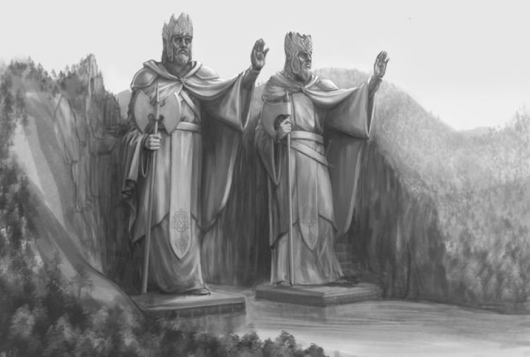
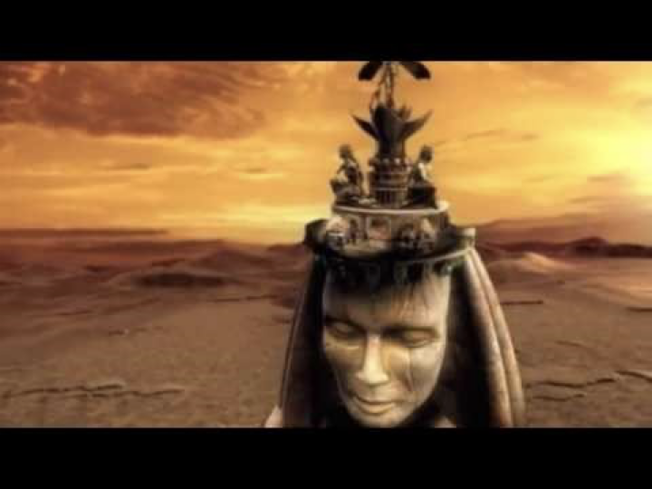
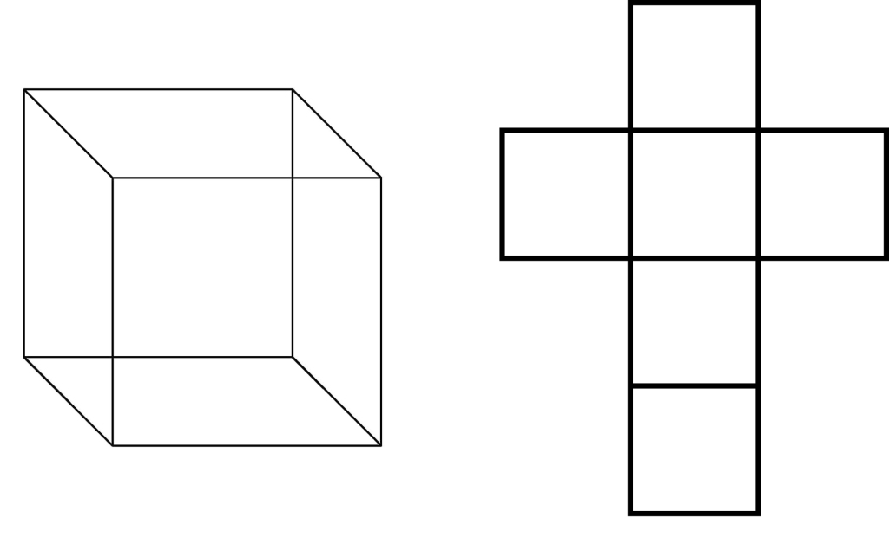
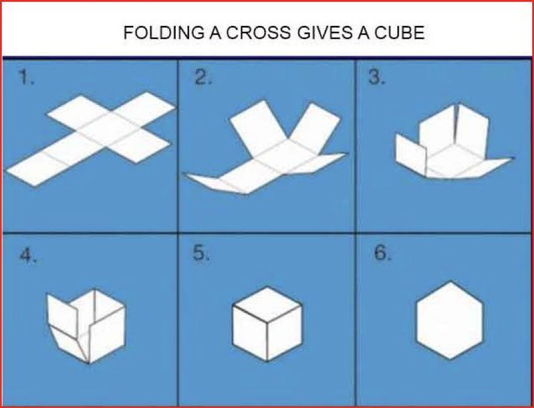

(част 1 – Въведение)

> „𝐈 𝐮𝐧𝐝𝐞𝐫𝐬𝐭𝐚𝐧𝐝 𝐭𝐡𝐞 𝐆𝐚𝐦𝐞 𝐧𝐨𝐰. 𝐈𝐭’𝐬 𝐜𝐥𝐞𝐚𝐫 𝐟𝐨𝐫 𝐦𝐞 𝐭𝐡𝐚𝐭 𝐭𝐡𝐞𝐫𝐞 𝐚𝐫𝐞 𝐜𝐨𝐧𝐬𝐞𝐪𝐮𝐞𝐧𝐜𝐞𝐬 𝐨𝐟 𝐝𝐞𝐧𝐲𝐢𝐧𝐠 𝐭𝐡𝐞 𝐩𝐫𝐨𝐠𝐫𝐚𝐦 𝐢𝐭𝐬 𝐩𝐨𝐰𝐞𝐫.“

> „Разбирам Играта сега. За мен е ясно, че има последствия от това, да отричаш силата на програмата.“

Ra Uru Hu

_(това е статия, писана през вече „далечната“ 2020 и авторката е еволюирала и надградила доста оттогава, но все пак, тази информация съдържа и много същностни пластове, и има своето място в процеса и следва да бъде публикувана и тук☺)_

Човек и добре да живее (или поне така да си въобразява), започва да пише за архонтите или по-лошо – да си има работа с тях.При мен това е процес, който тече отдавна, връщайки лентата назад и в синхрон с належащото себеосъзнаване, то активните ми наблюдения са от около 5-6 години насам. Преди горе-долу толкова време по редица стечения на обстоятелствата имах перфектните условия да се занимавам по-сериозно и задълбочено с ‘езотерика‘ и окултизъм и въобще да се обърна навътре към себе си и да се отдам на (по)знанието и четенето. По това време получих възможността да живея в изолация (before it was cool), а също така, можех и усърдно да тренирам и медитирам, спазвах много изчистен режим на хранене (без консерванти, junk food и всякакви други вещества или пък информационни потоци, затварящи съзнанието) и всичко това създаде перфеткната предпоставка за „потъване“ в дебрите на Мистичното. Започнах да изучавам различните религии и митологии (особено ислям, митологиите на Шумер и Древен Египет, също така и магическо изкуство и естествено всяка „бродеща“ наоколо конспирация; изчетох, естествено, и всичко което е налично в БГ „езо ефира“). Не подминах и историята, културлогията като дисциплини, най-вече поради факта, че учех по това време подобна специалност в университета (съответно и черпех доста силно от различните свързани егрегори, съдържащи доста информация). Изучавах и семитски езици. С една дума, бях се заровила като прасе в тикви в окултната литература и търсенето на „голямата истина“. Забавно е да се отбележи, че този период започна със силна фрустрация от моя страна по всички теми свързани с конспирации, извънземни, астрология (с която се занимавам вече от доста години), и като цяло, реакцията ми беше „не ме занимавайте с тези глупости“, но навлизането ми в определени теми, съпътсвани с определени преживявания, обърна тази моя нагласа на 180 градуса ме засили директно “in the deep shit“. Трудно ми е да определя кое конкретно отключи това, но подозирам, че освен комбинацията от фактори, конкретно влияние за отключване на генетичната ми памет от „минали ми живот“, причината беше изучването на арабски език и иврит, също така прочитането на Корана (който си е един доста солиден егрегор съдържащ множество кодове за активация, за разлика от Библията, която вече толкова се е разводнила най-вече от преводи и преекспониране, че почти нищо от изначално заложената енергия и намерение не е останало). Интересно е да се отбележи, че и изучаването на историята на ранните халифати, отключваше в мен изключително силна рекация на авто-регресия, като аз буквално не можех да си взема шибаните изпити, тъй като след има-няма 20 минути четене, „припадах“ в дрямка (буквално все едно някой ми изключваше шалтера и като последствие навлизох в сънувано осъзнаване на паралелни реалности), от която се събуждах в меко казани странни състояние и със странни спомени и знания „от нищото“. Доста бързо стигнах до книгите на МорнингСкай и работата на Paralelreality, които вече ми се видяха като „самата явна истина“ (like, come ooon, how you’re not seeing this???…). Тогава започна и реалният филм, защото тези издания са адски натоварени с определена енергия, която просто „смъква воала“ на илюзията и ръчка жестоко самите основи на кода. Всичко това разшири съзнанието ми и ме засили директно в света на ОИТ-а.След всичко това, да кажем, че затворих очите си за света и прогледнах наистина…този път.
В този период започнах да имам изключителни силни ОИТ, астрални проекции, както и редица по-неприятни и стресиращи преживявания (в този период даже отключих ‘автоимунно заболяване‘, long short story, ако тегля чертата, нямам алергия само към месо и определени плодове – carnivorous, a?). Незабравими бяха и срещите ми, не от 3-ти, 4-ти и 5-ти вид, а направо то 10-ти (имах невероятно силния осъзнат ОИТ, в който се разхождах гола пред спрелите погледи на извънземни, които ме попитаха телепатично „защо пак си излязла от камерата“ – ще разкаца подробно това друг път;Д ).

But before we get to the weird side of the internet again, едно по едно...
За щастие, бях съобразителна да си водя записки и дневник на сънищата, за да не би случайно да пропусна нещо от този процес. Естествено, не всичко е записано или запазено, както и вече не всичко мога да си спомня, още по-малко пък с присъщата му уникална и силна енергия, с която е било импринтнато самото преживяване в момента, но…все пак, черно на бяло го има. 

(Отсега предупреждавам, че тази статия е малко субективна и карам изцяло на дясно полукълбо – демек, мои преживявания и интуитивни прозрения. Не ме интересува откъде идва информацията и няма да си губя времето и енергията да я рационализирам излишно. Тук просто споделям моята опитност.)

**В крайна сметка, всичко започна да се върти около скапаните архонти.**

Така, моите първи срещи с архонтите и всъщност първия път, когато узнах за това име, беше в един сън. Преди това дори не бях чувала думата ( поне нямам съзнателен спомен ) колкото и да е странен този (необразован) факт…..Мисля, че в този период вече бях навлязла доста навътре в материята и ОИТ-овете ми започнаха да стават брутални и все по-осъзнати и контролирани и съответно бях „хваната“, че се навъртам не където трябва. Самият сън, в който се срещнах с архонтите, все още си го спомням доста добре. Бяхме някаква група хора, явно се познавахме в т.нар. „астрал‘‘ и мисля, че бяхме и в паралелно измерение (повечето „сънища“ са по същество преживявания в “паралелни измерения“, а „астрала“ е нещо като layer между тях, пресичане и наслояване на образи), и не помня точно какво е ставало преди да навлезем в нещо като подземна гробница. Преобладаващите тонове бяха в светло-сиво и всичко изглеждаше доста прашно някак си, такова усещане оставаше в мен/нас (усещах другите в групата). Имам лек спомен, че бяхме с раници и май носехме нещо в тях, нещо което бяхме..откраднали? Кристали, maybe, who knows…Аз се загледах в стените и видях как постепенно те започват да се ронят и от тях се оформят човешки тела, които, сега като се замисля, ми напомнят точно на ето това:

_Това за съществата от клипа на Linkin park – In the end._
_(междудругото, в началото на този клип има един доста интересен кодиран текст, който малко напомня като стилистика на иврит, но представлява прост геометричен шифър за заместване, наречен **pigpen cipher**, който се оказва – никак не изненадващо, че е бил използван от фримасоните и розенкройцерите (чиято литератира е изключително стойсностна, btw, и на база на която ще публикувам доста излседвания в бъдеще). Повече инфо, за евентуалното разшифроване можете да откриете тук: http://scienceblogs.de/klausis-krypto-kolumne/2017/07/22/who-can-decipher-this-encrypted-text-in-a-linkin-park-video/. Повече не съм си правила труда да проверявам, засега не е в моята синхронистична нишка...)_

Тези човешки тела се оказаха оживяващи същества (които дълго време са били „заспали“ и нашите действия ги съживиха), и които започнаха постепенно да се оформят и да излизат от стените и тогава настъпи осезаем страх и паника и някой се развика: _“архонти, архонти, бягайте….“_. В този миг всички хукнаха супер организирано като по филмите (поне беше супер забавно:DDD) и можех да наблюдавам отстрани как всичко се движи като на филмова лента (което малко провокира в мен въпроса, доколко естествено е било това изживяване–движение „като на лента“ в съня говори за използването на психотронни генератори за създаване на сънища), докато тези същества по някакъв странен начин започнаха да ни преследват, незнайно как, защото очевидно не вървяха(!!!), а все едно летяха или по-скоро се придвижваха през време-пространството(???); но Ви казвам такова бягане нито съм сънувала, нито съм тичала:D Паниката беше **зловеща**. Нека да подчертая още драматизма, усещахме чесме събудили древна сила, която не е трябвало (така че, ако нещо сме осрали – сори…;д).Опасявахме се, че ако ни хванат всичко е ‘край‘. Самият край. Ужасен край. В момента ми се губят други подробности от линията на съня, от преди и от след това, единственото, което си спомням е, че стигнахме до нещо като **спирка** (което е символ на придвижване от едно измерение/ниво в друго или от едно ниво/клъстер на астрала на друго). Следващото нещо, което помня е, че се събудих плувнала в пот и веднага си записах името „архонти“ в дневника за сънища до мен. 
Идея си нямам как е приключил сънят, но сега предполагам, че качването в колата на всики ни е било ‚излизането‘ от астрала (всъщност, вече не съм сигурна дали трябва да го наричам астрал…), като съответното излизане не си го спомням, сигурно защото вече не съм имала достатъчно енергия да поддържам тази тази паметова следа…

_(Междудругото, тук отварям една интересна скоба, че обикновено самото начало на съня и навлизането в подобна опитност не се помнят после в будно съзнание, а трябват целенасочени тренировки, за да може сънуващият, да започне да помни и началото на съня си. Интересното е, че два пъти реших да пробвам с някакво магическо заклинание, което ми попадна случайно, за да започна осъзнаването на съня от самото начало – и се получи! – при това изксочиха интересни подробности –първият път видях голям сив левитиращ и въртящ се куб в центъра на пустиня, а на самия квадрат имаше лицето на сив; другият случай беше, когато се опитвах да достигна архетипа на Луцифер и да видя какво се крие зад него – спомням си, че в съня си навлизах в някакво тъмно пространство и тъкмо се готвех да отворя вратата, за да видя „лицето му“ и ме нападнаха 2 изключително злобни черни кучета. Това със сигурност, беше т.нар. „астрална охрана“ и тя наистина доста често се използва, когато нещо трябва да бъде държано в тайна и под защита. Не знам дали беше астралната форма на някой маг, егрегор или нечий действителен извънзмен образ, но усещането, което получих от кучетата е, че охраняваха нечий женски образ, който е първоизточник на архетипа. Кубът със сивия, пък си е типичния ‘lock’, който трябва да бъде отключен, за да стане съзнанието на обекта достъпно, тъй като повечето „сънища“ са наистина програмирани „реалности“ от сивите и техните технологии, в случая 100% съм убедена, че е ставало върпос за препрограмиращ сън, каквито имах адски много по това време. )_

Мисля, че оттогава започнаха вече наистина сериозните проблеми от енергийно естество в живота ми и по-надолу ще обясня какво имам предвид. Всъщност, не съм съсвем убедена дали е имало чак такива големи проблеми или просто осъзнаването за тях се е „изострило“. В крайна сметка, повишаването на „вибрациите“ (а.к.а скаларният потенциал на съзнанието) открива полезрението ни за множество съществуващи нива на реалността, които досега са били оставяни незабелязвани. Колкото това е философски въпрос (на перспектива), толкова е и въпрос на механика.

Но защо е важно да споделя моите преживявания с архонтите? За какво въобще ги има? И за какво се боря?

Първо, защото очевидно Висшият ми Аз иска това,

Второ……..

Етимологията на името сочи, че **архонт означава „управител“**.

**Какво Управляват Те?**

**Очевидно, някаква система… Всяка система има нужда от нива на управление, йерархии,за да фукнкционира. Съответно, има нужда от Управители** или **надзиратели**. В гностицизма, Архонтите са 7-те планети: Сатурн, Юпитер, Марс, Слънцето, Венера, Меркурий и Луната. И какво мислите, е управляват те? Матрицата, в която живеем...Астрологията..мда ☺  Но за това ще говоря много подробно по-нататък...Накратко, така започна запознанството ми с Архонтите и тяхното изследване ☺

**Малко Философски аспекти…**

Сега, ако трябва да се разфилософствам, ще кажа, че целта на архонтите и органичните портали е да направят играта, която играем тук по-интересна и предизвикателна. Иначе няма да има смисъл да се играе. И това _от една страна е вярно_. От друга страна, обаче е неизбежно да ги има, тъй като това е част от механизма на кода, и те са неговите **keeper-и**, тоест това е просто механизма по който нещата се случват. Истината е, обаче че целта им е да ни държат в **ниски нива на съзнание**, нещо известно в езотериката като „ниска плътност“ или 3Д. Архонтите са контролния механизъм на симулацията и матрицата, който ни държи в капана на външния фокус – вниманието навън, пречейки ни да намерим вътрешния такъв – вниманието навътре, вътрешния лабиринт или начинът излизане от матрицата. Те си служат с различни механизми, които целят да възпрепяттсват високото ниво на себеосъзнаване и раширение на съзнанието. Това е механизъм заложен в гените и за цялата генетика може да се говори, като за **генетичен императив**, чиято цел е да „тика“ матрицата в определена посока. Той се програмира в синхрон с 2 или 3 основни „кристала“ от тъмна материя, които са носители на съзнаието. Те формират 2 неща – **тялото или подсъзнанието (в Хюман Дизайн този кристал е наречен Design crystal)** и **личността**, или това, което си мислим, че сме (това е т.нар. **Personality crystal**). В допълнение, като част от полярната фрагментация на съзнанието се развива и **суперподсъзнание**, което се оформя в зародиша около третия месец от бременността.
Ще обясня всичко това подробно – целият мехнизъм на инкараниране и генетичен импринт, стъпка по стъпка, когато му дойде времето….

Това което, обаче мен повече ме пристеснява е, че другата им много по-съществена цел и предназначение, с което те лазят по нервите на всички тръгнали по пътя към „разкритието“, е че тези програми реално са инструмент в ръцете на играчите извън матрицата, за манипулиране и „блокиране“ в ниските нива на полу-осъзнаване или направо на тотално роботизиране и хомогенизиране. Самите архонти са пазители на гейтове (тоест порталите), но те могат да бъдат използвани по различни начини, от различни играчи, според механиката на системата и целта. Във всеки случай, те се подчиняват на един общ принцип и на генетичния императив на Играта. Да, те следят кода да „върви“ както трябва, но в същото време, те могат да служат и като насочващи „станции“, които да ни помогнат да изпълним потенциала си, който обаче, отново е зададен по генетична програма. Но тъй като живеем в дуалност, всичко си има и обратната страна. И точно тук те могат да бъдат **хакнати**.. от този който познава кода, разбира се :))) Това е и идеята на цялото истинско магическо изкуство – манипулиране на кодовете на симулацията в наша полза, тоест борба с детерминизма и манипулиране със свободната воля на Егото, доколкото все още я имаме. Важно е да се отбележи, че Земята, принципно е поле на остър конфликт на еволюцията на съзнанието, между детерминизма и ограничената свободна воля.

Държа да подчертая, че темата за архонтите ще бъде едно изследване върху цялата система на Симулацията, което ще се разгръща постепено. В него ще има едно доста осезаемо присъствие на системата Хюман дизайн, както и на астрологията и философията на Розенкройцерите. Изследванията ми включват и работите на Блаватска и Алис Бейли, както и дисциплините на демонологията, анегологията, гностицизма и таро и много други. Това е нещо, по което работя от години. Всички тези учения и системи са няколко различни начина и различни аспекти на една и съща истина – астрогенетичният и астрален код на homo sapiens и как работи Играта в тази част на Вселената, и по сспециално –Земната платформа. Всички тези системи от информация са „изтекли“ от различни източници на извънземни и земни фракции (включително Обществото на Енки - култа към змията) и идват от ренегати, които се стремят да предоставят кода за матрицата. От друга страна, популяризирането и комерсиализирането на тези науки е подтикнато отново от определени фракции, с цел именно да се затвърди следването на този детерминистичен код. Разбирате, че става въпрос за схемата „разделяй и владей“ и като цяло трябва да се бяга от всякакви егрегориални интерпретации на ученията. Самата система работи с понятия като, код, съпротива, потенциал, реакция-отговор, цел, среда, мотивация, трансференция и т.н. Цялото ми изследване ще взема за основа “откровението“ на Ра Уру Ху, представено чрез системата Хюман Дизайн, тъй като това представлява най-прецизно подреденият информационен поток, който имаме за нашата локална матрица. Понеже живеем в квантова система, тя се подчинява на законът за информацията, именно че последната трябва да се разпространява свободно в системата, за да може тя да е свързана и функционираща. Или както се казва, няма скрито-покрито, стига да умееш да търсиш;)Разбира се, извънзмените полярности са напълно наясно с този факт, затова и го играят на принципа: **„ако те трябва да знаят за това, то ние ще им кажем точно каквото трябва да узнаят.“** Макар и по същността, това което се преподава като Хюман Дизайн да е поредния цикъл на пропаганда от една определена фракция, тази система следва да се взема доста насериозно и да бъде изучавана почти маниакално – доста истина и несравнимо точно инфромация има в нея.

Нека да изясня един принцип още отсега. Цялата информация, 100%, всичко, което се излива в информационното «езотерично» пространство (пък и политическо и научно, всичко е част от цялото и изкуствено се създава илюзия за разделение- «Разделяй и владей»), поднасяно под формата на ченълинг, блог, книга, каквото и да е било учение или личност, които са малко по-известни и забележими, е програмирано или частично програмирано събитие и съответната личност представлява **поставено лице (осъзнато или не) на някоя от фракциите.** Това не е параноя. Това е факт. Това е играта. Просто това е начинът, по който работят нещата! Не изключвам факта, а даже и все повече се убеждавам, че доста такива популярни говорители са шейпшифтъри… Замислете се. Живеем в изцяло стерилна, програмирана и контролирана платформа. **Планетата изпълнява ролята на затвор с различни функции** (няма да е лъжа, ако кажа, че сме под **планетарна карантина** – pun intended) . Защо трябва да има нещо тук, което не принадлежи към играта? Това би бил парадокс на самата игра (сега не ми се говори за парадоските-оставяме ги настрана, trust me, не сме от тях, малцина са те, но и те са част от друга игра…). Освен, ако съответният източник на информация не е тук в качеството си на **Наблюдател**, трудно бих очаквала обективност. **Наблюдателите са “инкарнирани“ пратеници на различни наблюдаващи фракции и обикновено са тук с официална цел**. Тенямат право да говорят. Само наблюдават и събират информация от личен опит – да видят нещата “на терен“ и после естествено “докладват“ на съотвената фракция, както и пред различните Комитети. Разбира се, и тук има игра, защото много от тях могат да бъдат «активирани» и препрограмирани да служат на определена адженда. Отвъд това, те не могат да разпространяват свободно истински стойностната информация без филтри. Всяка информация има пропаганден и личностен филтър, както и следва правилото 90/10 – 90% mindblowing truths и точно 10% манипулативна лъжа/изопачаване, което е и нарочно, е и механизъм на лингвистично програмиране. Така че, просто не могат. Такъв е законът/така е написан кодът. И колкото по-надълбоко отивашв знанието и осъзнаването, толкова по-ясно става това. Трудно бихме могли да мислим без езика и неговите ограничения. Просто казано: всеки чува каквото си иска или каквото може (до което ниво, опитност, път е стигнал и от тази съответна гледна точка, всеки си следва фрактала).Всяко същество неизменно ще пречупи информацията през собствените си филтри на опит и биография. Както казва Ницше, всяка философия не е нищо друго, освен собствената ни автобиография, а всяко говорене по съществое философия, дори когато претендира за научна изчерпателност. Просто съзнанието е над всякакво емпирично наблюдение и възприятието и перспективата ни за нещата непрекъснато се мени. Това, обаче, не означава че няма истина и че ние не сме фиксирани на определени пътеки – **фрактали** – те крепят съзнанието “стабилно“ и «в опитност». Означава само, че истината е субективна в изразяването си и възприемането си, не че я няма в една същност и форма….Означава също, че и доста често говорим за едно и също, без да се разбираме за това, както и обратното... Лингвистично-генетичното програмиране е наистина забавно :)))

Така, ако все пак Наблюдателите проговорят, моментално биват «изтегляни». Все пак, в момента, в който един наблюдател успее да пречупи програмирането си, както и общата съпротива, която среща от настройката на програмата и реши да говори, губи статута си на висш член на Империята или Федерацията (зависи, който го е пратил тук), и (о)става политически затворник на Земята. Гаранция, повечето не искат това. Подозирам, все пак че има няколко такива, но това не променя факта, че информацията, която подават е леко оцветена от перспективата на съответната фракция и нейните интереси, «вкаменявани» в колективното съзнание милиони години наред. Няма как да бъдем “обективни“ (whatever the hell that means..) . Лично за себе си, се убедих, че доста популярни езотерични фигури са просто поредните играчи, за друго, честно казано, още се чудя…Във всеки случай, едва ли има вариант, в който можеш да не играеш личната си съдба.

И все пак, има една истина замеханиката на нещата, защото това е наука, тоест логос и отговаря на някаква историческа фактология. Ако нещата се случват, това означава че са в система.

И така….

**Защо въобще има архонти и органични портали?**

Матрицата е сбор от фемомени. Това представлява един сравнително сложен, но доста стабилно работещ комплекс от системи, които имат за цел **абсолютния контрол**. Вече, формите на контрол са много.Ето някои от тях:

1. Земята е **Ферма**. За всеки, стъпил сериозно на пътя на езотериката и себепознанието, концепцията че **Земята е затвор и ферма**, трябва да е ясна като бял ден, иначе, сори, но дори още не сте в началото на пътя. Допускам, че това се чете предимно от хора, които боравят добре с **енергията** и имат **усещане** за нещата, тоест не са лумпени или органични портали. За симулация и ферма (жътва) се говори буквално във всеки езотеричен, религиозен, гностически, митологичен и всеки по-сериозен окултен текст, и да не се чете между редовете си е направо недопустимо. Отново – абсолютно всяко мистично учение говори за това. Всички тайни учения от началото на летописа, са имали за цел да разкрият „тайната на тайните“ или т.нар. философски камък и тази тайна се чете навсякъде, под формата на кодирано послание, за този който умее да чете между редовете, а на места си и написана черно на бялоЦелите на фермата са много – от точене на енергия, през добив на полезни изкопаеми, до използването на чисто физическите тела за храна, както и разбира се на процеса на „жътва“ на съзнанието.

2. Земята е **затвор**. Планетата е затвор за „провинили“ се извънземни, прегрешили срещу някоя от фракциите. Обикновено тук се пращат по-големите „клечки“, които обикновено и вършат няккава работа за фракциите ( предварително програмиране), и бивайки използвани като информационни мулета. Земята е мястото, където се затварят особено „прегрешилите“, които са във високи нива на съзнание, тоест са напреднали и тяхната изолация веднзъ за винаги от делата на галактиката е наложително, като разбира се, идеята е да бъдат „изтикани“ и „набутани“ обратно в ниски нива на съзнание. Това, разбира се важи и за средните нива на съзнание, както и за по-ниските такива развили се на Земята, като крайната цел е всичко това, което не може да бъде препрограмирано в био-роботи за империята, да бъде изтласкано в т.нар. 2D – символ, на което е самият кръст, който представлява не друго, ами двуизмерна репрезентация на на 3D кубът, който от своя страна е репрезентация на 4D тесерактът и т.н.

   
   

   И ако на някой не му се впрва, че има живот във второ измерение, го съветвам да прочете за флатландия или да погледне ето този епизод от знаковия сериал **Orville**:

3. **Земята е поле на Игра от ново ниво**. Философията настрана, на едно по-практично, **политическо ниво** (хах!) бих казала, нещата добиват доста конкретни измерения. Като една от (бившите?) колонии на Империите, Земята е място на всякакви **експерименти**, където могат да бъдат отделени следните групи:
   - предишни играчи от платоформата (атлантиди и други, които са средно напреднали, предимно полярно светли все още, все пак нали това в момента се води пета версия или пета раса на симулацията)
   
   - извънземни затворници (тук групата е наистина разнообразна и заслужава цяла голяма отделна статия) – това са обикновено силно напреднали съзнания, но и не само. Срещат и типичните закостенели извънземни инкаранции, зациклили в тъмните или светли модели на ниско ниво.
   
   - „любимите“ органични портали – създания ностители на витална сила и материя, но без его-воля, тоест без съзнание.
   - други случайни и временно генерирани форми от симулацията, които не са самостоятелни съзнания.
   
История на самата матрица, както и механика няма да описвам засега, а ще разглеждам само отделните технически аспекти на това. Засега съм по-склонна да приема теорията, че тази матрица е съвсем буквално, физически съществуваща (тоест не сме на кораб и това не е тренировъчна симулация, като в Стар Трек, примерно, лол); но все пак не изключвам възможността за **“тренинг симулации“** (тоест излиза, че в момента аз си пиша сама, с още може би 5-10 човека.:))) Не изключвам възможността и аз да преживявам такава, преди действителното ми ‘поставяне‘ на реална планетна колония….:)
   НО, по-скоро всичко е мета-реално и самата „реалност“ е програмирана на квантово ниво посредством широко-свързана гама от технологии – нано и биотехнологията на **black goo (черното масло)**, различни видове "кристали" импланитирани в мантията на Земята и в клетките на човешките тела, както и решетките около земята, които представляват различни дефлектори; също така и насочените неутрино излъчватели и преобразуватели (главно на другите планети от слънчевата система, както и от слънчеви системи в съзвездията Голяма мечка, Плеяди, и естествено любимата ни звезда – Сириус :P), с това и различния технологичен и социален комплекс обслужващ първичното генетично програмиране. Това си е един доста голям, добре смазан и работещ технологичен комплекс, който ще опиша постепенно. В случай, че не бъда спряна. Ще опиша и технологията стояща зад астро-генетичното програмиране, което специално изследвам.
   Обратно към действителността… kind of…

Защо въобще говорим за **програмиране**? Защото животът, както го познаваме днес на земята не е възникнал случайно. Вярно, че всичко във вселената почива на една математическа закономерност, но тук можем да говорим за вторично и за даже третично програмиране въз основа на изначалната матрица. Имаме пластове от програмиране върху програмирането. **На всяко ниво, обаче, се създават програми-пазители, които да отговарят за процеса и именно те са диференциацията, която разделя и форматира отделните реалности**. Тоест, има компресия и множествено отдалечаване от първоизточника, и на всяко от тези нива има различна форма на съзнание и възприятие. Съзнание програмиращо съзнание. Предполагам повечето от Вас са запознати с книгите на Морнинг Скай (отново и отново), а ако не сте, е хубаво това да стане, понеже те са най-достоверния и пълен ресурс, който имаме относно истинската история и всичко останало трябва да бъде надграждано над и около него. Без история ще се лутаме в безсмислени теоретизации. Зад всяко нещо има основание и причинно-следственост, и историята помага да се видят тези нишки на реалността. Посочените език и истории в книгите му са доста конкретни и точни и всеки друг ченълинг е хубаво да се пригажда към този, макар и той да има своето политическо изкривяване. Нещата на Еаша Ашаяна също са доста солидни, но там пропагандата на псевдо-светли за христовото съзнание (а.к.а. Енки и Еа-Су) ми идва в повече. В нещата на Алис Бейли също има доста подхвърлена информация, както и в редица други книги, които сега няма да изреждам. Както вече казах, информацията е разпиляна, но тя се събира като един доста хубав пъзел, ако се следват синхронизациите и пътя на логиката. Сега, никой ченълинг не е перфектен и РМС си има своите изкривявания, но… то затова трябва да се мисли и да се търси, а не да се поема някаква информация наготово и да се препредава като папагал, само защото „ни повдига вибрациите.“ Всичко може да ти повдигне вибрациите (както и други неща), стига да е импринтнато със съответната енергия. В случая, става въпрос по-скоро за изключителната енергия на тази ифнормация, която директно „отваря“ съзнанието и предизвиква много силни синхронизации и странни преживявания – нещо, което само истината прави. Трябва да се търси разширение на съзнанието, а не „вдигане на вибрациите“, само…

Anyway, хубаво е да се помни, че момента, в който някой ви говори прекалено мило или стереотипно и се заканва как ще дойде да ви спаси и всичко ще стане цветя и рози, значи сте поели солидна доза булшит. Има много наблюдатели, които са започвали да говорят истината, но впоследствие за препрограмирвани от архонтите. Трябва по-критичен поглед и за съжаление виждам, че повечето хора не познават самия живот и неговата сурова прагматичност, а са като малки невинни дечица, които са привличани като молци към различни „лампички“ на просветление и знание. Това са „младите и светлите инкарнации“. Това, че някой те зарежда с „позитивна“ енергия, не означава че и ще ти предаде стойностна информация като съзнателно познание. Слушайте/четете между думитеСъщо толкова притеснителни са ми и хората, за които това са „пълни глупости“, но на тях по начало давам един солиден ignore, тъй като са ми нек‘ви сухи плъхове, а теорията сочи, че са и обикновено агенти на самата матрица или органични портали:)

Говорейки за източника на „светла вибрация“, ето нещо за размисъл:

   https://www.youtube.com/watch?v=fCa-v2CeyY0

_Сцена отсериала “V”, в която Anna и дъщеря й – хибрид между изънземната рептилска раса и земните хора, „облъчват“ хората с мисъл-форми посредством машина, която имплементира в населението чувство и преживяване на ‘bliss“ и „светлина“._

Разбира се, сигурно и аз няма да бъда докрай изчерпателна и обективна, понеже и аз представлявам определена фракция (аз поне не се правя, че съм «чиста»;О). (бел.ред. – към 2023 вече мисля, че съм доста обективна...).

НО! Никой и нищо не е 100% и това не зависи само от намеренията или знанията на субекта, а и от начина по който информацията се изкривява, когато се предава чрез езика от съзнание към съзнание. Никой не е 100% към общата истина, но е 100% фрактал от цялата истина! Затова се осланяйте на това, което резонира с вас и на което можете да се доверите интуитивно. Моят произход (поне докъдето си го спомням), е от стара тъмна **Сирианска Фракция на РА** – Известни в колективното съзние, като Йерархията **Ursa Major**. Аз съм ренегат и затворник.Заточена тук, заради предателството си към офицалния двор и договора на сирианците с драконианската кралица.Както и да е, формацията, от която произлизам е един от архитектите на локалната симулация. Съответно, информацията тук идва директно от един от първоизточниците - архитекти на **локалната** игра (да не се бърка с по-горните пластове на Играта).

Важно уточнение е, че единствено тъмната страна може да говори истината тук, ако реши, но хората на ниво личност са така програмирани, че не биха могли да възприемат тази информация. Информацията подавана от тъмната страна е твърде директна и тежка като вибрация, и без емоция или „сладникавост“ в нея, без морално противопоставяне или обвинение, затова и обикновеният човек, програмиран да реагира на емоционални стимули, просто ще бъде отблъснат, защото му подтиска егото или някой друг аспект на личността. **Истинската информация е извънегрегориална**. Отново, всичко това е код. Изключително лесно е да манипулираш човек чрез емоционалното му тяло и тялото на егото (които са аспекти на личността). Това е направено така с цел, от Йерархиите. Съответно, съзнанието тук, оперира през тези капани. От една страна, емоцията хем има нужда да бъде изразена, от друга, тя може да стане причина за „падение“. Това е астро-генетично програмиране, което е много трудно преодолимо. И отново, то контролира личността и тялото. Голяма част от хората са програмирани да са емоционално уязвими, а друга част биват повлияни от този къндишънинг (обусловеност), и са по-склонни да приемат изреченото от някой, който дори само претендира, че е емоционално отворен и добър към тях. Това, както се досещате, отваря много вратички за манипулиране. Ако не си склонен да надраснеш собствения си фрактал и да поглеждаш истината от различни посоки, това си е рецепта за провал като съзнание. _(бел.ред. към 2023, след събитията от последните години и вече към края на Плутоновия цикъл в Козирог, обаче виждчам, че нещата започват да сее променят и доста хора оценяват истината хладно и безпристрастно)_. Нещата отново обаче не са едностранни, и емоционалното тяло е източник, освен на огромна физическа сила и на духовна такава, и е център през който се осъществява катализата на т.нар. духовен напредък. Не случайно, то е цел на всички препрограмирания, които се правят от фракциите. Точно затова е и толкова важен за хакване и контрол. Get it? Ето и нещо за размисъл по темата, отново от сериала “V”:

https://www.youtube.com/watch?v=smDRrHh6vdg

**Накратко, емоциите могат да бъдат източник на илюзии или истина и ние не можем да направим нищо по въпроса.Това, което трябва да помним, е да търсим собствените усещания за нещата.**

**–May the Force be with us–**
