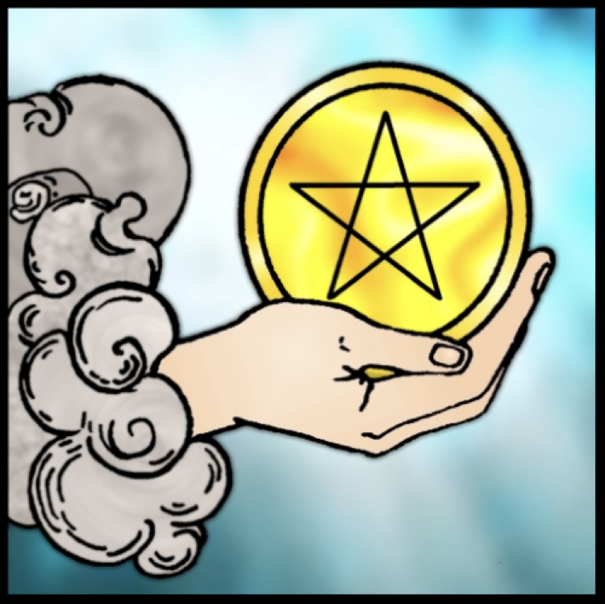
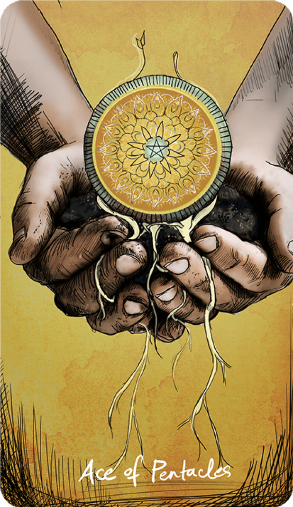

Ще представя моя опит с картите таро в любовните въпроси през една малко по-различна светлина и с известна доза отрезвяваща критика, прекрасно прилягащ на Слънчевата ми козирожка природа.  Често пъти, когато питаме картите, особено за любовни въпроси относно потенциална или тепърва започваща връзка, ние търсим конкретен и прагмaтичен отговор, а не някаква отнесена в облаците приказка. Искаме да знаем какво ще направи или мисли човекът тук и сега, или какво ще предприеме или пък чувства към нас. Пентаклите са идеалното поле за този отрезвяващ процес и поглед. Tълкуванията на картите са ориентирани от женска гледна точка.

**Асо Пентакли** – ясно индикира възможност. Има портал на възможностите и той е отворен. Някой ви държи като опция или възможност и е възможно да се възползва от нея. Смята, че сте много изгодна партия. В най-позитивния вариант – паднал му е късмета от небето, не може да изпусне този шанс. Човекът е доволен, че му се е паднал такъв жребий, но не знае какво да прави с него. Често, може да индикира, че мъжът осъзнава, че ще трябва да подходи по-традиционно и да предположи някаква материална „примамка“. Ще ви предложи нещо, ще направи жест. Другите карти ще подскажат дали това е така действително или само ще премисля. Асо пентакли не е лоша карта, но като всяко Асо, е по-скоро идея, отколкото действие . Потенциалът е налице, възможността не е за изпускане, но как ще се развият нещата, зависи от другите карти. Това е нещо, което отдавна сте чакали. Но ще има нужда и от други фактори, за да се действа в тази насока. Най-общо, тази карта индикира добра възможност, която не трябва да пропускате поради някаква причина.

**Двойка Пентакли** – като всяка двойка, тук човекът просто не знае какво да мисли.. претегля и преценя. Има двойна игра...не се знае в какво (другите карти ще покажат).  Не се надявайте много, най-вероятно претегля между Вас и друга опция. Ако това не е случаят, то значи се чуди какъв избор има пред него от чисто практическа гледна точка за действие и изчаква Вашата реакция/отговор/подсказка. Затова и изчаква знак, за да предприеме нещо или да инициира комуникация. Претегля възможностите във вече създалата се ситуация. Чуди се какво ще стане, ако предприеме определен ход. Бездействие, колебание.

Може, също така да означава, че има нужда от повече комуникация и обмен, от физически контакт, за предприеме действие. Иска да обсъдите нещо от прагматична гледна точка. Картата може да индикира и някакви капризи.

**Тройка пентакли** – има нужда от разговор и обсъждане, както и от изясняване на ценностите и позициите за връзката. Двойката не работи или идеите, които са дошли от асото имат нужда от избистряне. Ключовата дума тук е комуникация – комуникирайте! За предсказване – възможно е да се свърже с Вас, за да изясните нещо. Ще иска да придвижи нещата, да пообщува с вас. Възможни са разговори, включително за развитието на връзката (както междудругото и карта Умереност показва това). Началото на някакво начинание и проект. Но всичко е все още флуидно и в процес на преговори. Срещи. Даже може би ще Ви заведе на кратко пътуване. Може да ви покаже и пред приятелите си. Общо взето, всичко което изисква изясняване на комуникацията и взаимоотношенията Ви. Нужно е да се види перспективата за взаимоотношенията. Може трети човек да се меси в тях.... Дано не е майка му…но може да е и приятел или бивша/настояща... Накратко, тройка пентакли са разовори и изясняване на ценностите – имаме ли разбирателство?

**Четворка пентакли** – Стабилност. Нещата вече са се укрепили и са в стагнация. Човекът не ще или не може да помръдне от създалата се ситуация. Няма да действа повече от абсолютно необходимото. Картата се управлява от Марс в Козирог и Слънце в Козирог и това говори достатъчно за характера й. Ако се е паднала тази карта и човекът не действа, значи не вижда никаква практична полза от това или е твърде затворен в чувствата си – козирозите не умеят да се изразяват. Ключовата дума тук е амбиция – накъде го води тя и има ли я въобще? Нужен е драйв. Хубавата новина е, че един от порталите в Хюман Дизайн, който отговаря за тази карта, се нарича „Омъжената мома‘‘ и отговаря точно за намирането на солиден партньор в обществото, с който да изградим нещо. Това може да е Вашият провайдър...ако реши. Ако човекът не предприема никакви действия, значи се чуди дали сте keeper-а за него, дали отговаряте на неговите амбиции за дом и стабилност в живота. С четворката нещата остават на място, засега. Негативвен аспект показва  емоционална недосстъпност и блокажи, човекът не иска да чувства и се е обградил със тени - емоционално затворен и предпазва емоциите и чувствата си с бездействие. Очаквайте студенина. Те го държат на място. Четворката е стабилност, нужна ни е петица за растеж. В по-прозаичен смисъл – нещата остават такива, каквито са. Установената схема на действие. Също така, предпазливост. В поивитен смисъл, оначава че иска да запази статуквото и за него сте много ценна. Стиска Ви, като съкровище, което е намерил. Може да стане и скръндзав – оставете го.

**Петица пентакли** –  една от гадните карти в таро. За съжаление, не мога да си спомня случай, в който да ми се е падала и да е индикирала нещо добро. Може би, защото наистина рядко намираме човек, с който ще бъдем добре дори „в нещастие, скръб и бедност, докато смъртта ни раздели.“ Нещата е възможно да не спрат до тук. Но стават трудни. Спорове за пари. За ресурси. За уговорки. „Ама ти каза, че ще направиш едно, а то стана друго…“. Имало е нужда от сигурност, която обаче не е била подсигурена. Нужда от практически действия, които да донесат емоционална сигурност и които не са били предприети, и сега някой от партньорите се чувства зле. „Ние продължаваме по същия начин, но не се чувстваме добре.“ В най-лошия слушай – разбито сърце – „с теб съм, докато се налага…“. В емоционален план говори за студенина – говорете какво можете да направите един за друг.Позитивното тълкувание – може да означава трудности в началото (това е буквалното име на 3-ти гейт в Хюман дизайн, който е един от съответстващите портали на петица пентакли). Тези трудности трябва да бъдат преодолени. Другите карти, отговарящи за същия 3-ти гейт са Жрецът, 4-ка жезли, Крал Пентакли, и както виждате сформират обща тема: семейство и брак, така че това е една доста семейна карта. Мъжът си задава въпросът – „а аз мога ли да бъда провайдърът за евентуалното ни бъдещо семейство, аз достатъчен ли съм за тази жена? Аз мога ли да й дам всичко – дом, семейство, сигурност? Мога ли да й подсигуря бъдеще?“ Връзката има нужда от грижа, която в момента липсва. Човекът най-вероятно ще се погрижи първо за себе си.  От объркването се търси ред. Изисква се рационализация. Тест на духа. Изчаква се подходящото време за следващото действие.В по-прости обстоятелства, човекът просто не усеща грижа, подхранване или внимание. „Как стигнахме до тук?“ Липса на любовна комуникация. Или няма пари сега да ви звънне…оставете.

**Шестица пентакли** – след размислите на предната карта, следва една позитивна стъпка напред. Някой е решил да инвестира във вас. Ура! Щедър партньор, иска да направи впечатление и да се представи като заможен, състоятелен и значим. Обаче очаква да го оцените. И леко да го възвеличаете. Очаквайте жест, подаване на сигнал и да, ще Ви се обади.

**Седмица пентакли** – оценихте ли жеста и даденото? Време е за преоценка на развилата се дотук ситуация. Да продължаваме или не? Размисли върху връзката. „Каква я посях, каква я свърших, какво пожънах. Как се стигна до тук?“ Човекът в класическото Райдър-Уейт таро седи и се чуди какво е объркал, какво е можел да направи по-добре или в редки случаи – се радва на постигнатото – каквото-такова. Доста често нещата могат да прекъснат на този етап. Краткосрочна перспектива. В позитивен смисъл – семенцата са посяти и сега чакаме да видим накъде ще се се развият нещата. Нужна е визия за връзката. В негативен аспект – има много подозрения, недоверие, струва ни се че някой ни е подвел. Пак премисляме нещата. Ситуацията е зациклила тотално. Има нужда някакъв урок да бъде научен, за да продължи цикълът към осмицата –безкрайността…Каквото-такова, в крайна сметка.

**Осмица пентакли** – нужда от работа. Вече сме преценили нещата и сме взели решение – или работим по връзката или си гледаме работата. Това може да е връзка, по която има нужда от много работа. Също така, може да означава че нещата са в начален етап. Oсвен това човекът е взискателен и Ви гледа под лупа. Празни амбиции, суета и алчност. Този човек сигурно има изобилие от опции и затова не Ви търси… Гледаме по сбор на числата: 3+5 е 8 – ако не комуникирате през тройка пентакли, ще Ви чака петица пентакли… и така цикълът се завърта. Ако нямате комуникация с този човек, забравете. Имаме и 4+4 = 8, това са две четворки – двойна стабилност, знаете какво имате и просто работите по него или някой е вдигнал двойните прегради – 4-ката пентакли е затвореност в себе си. Във всели случай, става въпрос за доста предпазлив човек. Ако Ви излиза картата, но човекът не Ви търси, значи е зает да работи и това е. Това е решил. Гледа си работата. За намерение в позитивен смисъл – смята, че има нужда от много работа по връзката или вече работи за това връзката да потръгне. Или чака да види как ще се развие работата с вас… Класическото тълкувание е годеж, но да не прибързваме ::))) Осмицата е безкрайност, това е една безкрайна работа…Наличието на тази карта сочи наистина дълъг цикъл – или ще работите по връзката, или ще работите върху уроците, които трябва да научите от нейния провал. Точно заради това може и да означава годеж в дългосрочни въпроси – решили сме да започнем работа по дългосрочен проект в живота си, а всеки брак, в религиозен и духовен аспект, символизира обвързването ни с безкрая…. Във всеки случай, картата ни посочва да извлечем някаква поука и да развием умения от вече придобития урок по пътя досега.

**Девятка пентакли** – задоволената жена. Венера в Дева. Жена, чийто капризи са задоволени – „това е жената, за която искам да се грижа и да й дам всичко“. Или самодостатъчната жена – тази жена си има всичко, аз за какво съм й? В по-прозаично тълкувание, той очаква да предприемете следващата стъпка и да бъдете по-инициираща. Явно Вашата аура на успяла жена го плаши. Може да Ви смята за меркантилна ( значи е беден ;Д). Ако нещата са се провалили още при предните цикли, то това е индикация, че Вие ще сте сама и самодоволна, трябва да развиете самодостатъчност. Във всеки случай, Вашата самодостатъчност го плаши. Също така малко чувства, че сте извън лигата му и сте твърде изискваща, включително в материален аспект – вие по-развитата. Материална жена. жена, която има всичко вече, видяла е всичко. Девятката е мостът към завършекът – десятката. Може, също така да е решил да Ви остави на мира, защото смята, че нямате нужд от него. В по-позитивен смисъл: иска да Ви обгради с разкош, но отново, както с всичко в Таро, зависи от отаналите карти и текущия интуитивен енергиен импринт към момента, какво точно означава дадена карта.

**Десятка пентакли** – Домът. Завършекът. Щастието. Човекът, който виждам, като мой спътник.. или пък просто съквартирант:))) В по-прозаичен смисъл някой просто ще ви дойде или покани на гости, или ще имате някаква ситуация свързана с жилище…Да, човекът може да Ви покани да гледате Нетфликс, примерно (макар че това е по-скоро 10-ка чаши, и тук е възможно, нищо че 10-ка пентакли е по-сериозна карта). Но ще е яко ☺ 10-ката е щастие и завършек – това е логичният изход на нещата. Ако този човек не Ви търси и тази карта се падне – значи сте си уредили сметките и моралните дилеми и семейни ценности и всичко е ясно – край – десятката е край на един цикъл и вече имаме резултатите налице. 

**Паж пентакли** – това е младият дух, който вече вижда ясно възможността. Радва й се  – „как се уредих“. В по-прозаичен смисъл, това е мъжът, който смята че сте му вързана опция, седи и/или се чуди дали да Ви звънне. Хванал ви е на „кукичка“. В негативен аспект – незрялост в постъпките, прекалено приятелско или момчешко отношение, нерешителност. Има възможност, но не се възползва от нея. Седи, гледа и чака и се надява нещо да се случи. В сериозна връзка, би могло да индикира раждането на момче. При други обстоятелства, може да означава направен жест, при това нещо, което партньорът прави за пръв път. Предложение. Но това е млад и неопитен мъж, играч.

**Рицар Пентакли** – тук вече момчето е решително и по-узряло, това е един методичен и последователен млад мъж. Настоятелен. Очаквайте постъпките да следват думите му. Малко бавен е, но това е за добро, ако сте търпелива. Точен човек. Уверен. Ще Ви ухажва стабилно и традиционно. В негативен аспект – каквото си е наумил – това ще е. Липса на гъвкавост. Глупав и материален инат, ще Ви зареже без да му мигне окото. Човека има цели да гони.... За събитие – възможно е да Ви покани на ресторант или нещо подобно. Класически ухажор. Или поне ще бъде по-класен от предишните Ви. Но наистинаа бягайте от негативния аспект на тази карта, един от най-гадните е.

**Дама Пентакли** – Вие сте дамата на дома му. Може би една от най-позитивните карти, рядко съм срещала негатив в тази карта, освен при обърната й позиция или липсата на енергията в ситуацията. Ако се падне тази карта, човекът наистина Ви харесва към момента и вижда потенциал с Вас. Все пак, може и да означава просто, че ще се срещате доста вкъщи, а Вие ще сте ненужно натруфена… Вие сте спокойна, уравновесена и земно красива жена, той така Ви вижда..можете да бъдете и малко инат понякога...Има нужда повече от Вашата женственост... Вие сте типичната за него жена за семейство, сигурна и надеждна...порядъчна жена...мд, обърната позиция показа, че Ви смята за „лека“ жена....както и че имате особени разбирания и морал за нещата – това не му допада.

**Крал Пентакли** – Ето го и завършекът на цялата пентаклена одисея! В моите гледания, това често е бил човек, който е твърде зает да си движи бизнеса и проектите и въобще не му е до Вас сега. Кралят винаги е тежкар и си седи на мястото, а в случая с Пентаклите – дори още повече. Кралят буквално е извърнал глава, не се интересува и не Ви гледа. Вие сте на второ място. Той седи и чака Вие да го потърсите и да предприемете стъпка, евентуално. Той вече е заявил какво предлага. В по-позитивен аспект това е карта, която се достига в положително проявление, когато вече имаме хармонична, стабилна и сериозна връзка – това е стабилният, зрял мъж, който се грижи за семейството и за Вас. Няма нужда да му казвате от какво имате нужда - той вече знае и полага усилия да сте щастлива. Ако тази карта Ви се падне за някого, за когото гледате, запитайте се дали този човек може да бъде Вашият крал Пентакли. Крал Пентакли е свързана с енергията на Лъва – така, че ще бъде неговата воля, както той реши. Иска и има нужда от Вашето уважение, за да Ви дари с пентаклите си…и вниманието си. Сега не го чувства или пък смята, че вече е получил достатъчно внимание от Ваша страна и засега не му трябвате.  Логиката на действията го предпазва от малшанс. Залага на най-сигурното. Ако гледате за нов мъж в живота си, това е човек, който в момента се интересува да прави пари и жените са нещо странично в живота му. В тази карта има и съмнение… В най-положителен смисъл, когато нещата вече са се развили правилно, Вие сте пентаклата, която той е гушнал и просто седи и съблюдава реда на нещата – настойчивост въпреки трудностите носи наградата, разкритието не лежи в ангажимента, а в процеса. Ако кралят каже „да“ той ще мине през всичко с Вас. Изчаква да види дали нещо ще отнеме от вниманието му, докато се е посветил на работата си. За предсказание – може да мине време преди този човек да Ви потърси. А може и никога да не го направи... Във всеки случачй, Кралят пентакли е провайдърът, мъжът който уважаваме, но за него мъжките дела са на първо място и ако ние сме жената на живота му, той ще нащрави стъпка..ако не...well…има и други мъже ☺

Езотерична забележка: _Ако забелязвате, **всяка елементална поредица от малките Аркани завършват с Крал...** Както вече посочихме, **таро е поредица (сенквенция), която показва началото, равитието и завършека на един или множество процеси**. Също така, той е и **магически архетипен инстурмент**, създаден главно от няколко магически школи, които служат на **Сириус**....Това е  и причината Кралят да е накрая (забележете, че и има 3 мъжки дворцови карти и една женска...), което отговаря на извечния въпрос кой „избира“ или „дава връзката“ – според тези магически школи, това очевидно е „Кралят“, при това Кралят пентакли, демек зрелият, финансово осигурен мъж. However, помнете че от гледна точка на Висшия Аз това са пълни глупости и ние всички сме отговорни за всички избори, които правим, но тъмномагьосниеските школи на Сириус упорито ще се опитват да Ви вкарат в тяхната 3D адженда (която е и тежък патрархат, макар че служат на Орион, както можем да видим от карта Силата;) ...Тези общества се опитват да наложат определени адженди върху едовременните инкарнации и отчасти им се получава (защото човешката биология е значително базирана на тази на Сириус, това отново е капан за хората, които твърде много се идентифицират с телата си...но за това, друг път)._

Виждате, че пентаклите са един процес, през който преминава една евентуална бъдеща връзка, в процеса си на осмисляне и заземяване. Когато има много пентакли в гледанията, това обикновено индикира, че акцентът и менталните дилеми на връзката и партньорите се движат около това, дали съюзът има бъдеще и дали е благонадежден, дали материалната основа е подсигурена, дали сме стабилни и надеждни партньори за сериозна връзка, а не толкова върху това какви преживявания и емоции ни носи. Затова и пентаклите сочат обикновено към по-сериозни отношения (земна енергия). 

**Въпросите, които следва да си зададете са:**

- Дали това е наистина моят надежден партньор?
- Последователен ли е този човек в действията и думите си спрямо мен?
- Мога ли да разчитам на него?
- Материално и финансово адекватен ли е (спрямо мен) този мъж?
- Раздава ли се той за мен?
- Поставя ли ме като приоритет, неависимо от обстоятелствата?
- Аз единствената (истинска) опция ли съм за него?
- Партньорът ми може да ми подсигури материалната, финансова и емоционална сигурност и подкрепа, от която имам нужда?
- Имаме ли общи ценноти и виждия за съюза?
- От една и съща социална класа ли сме? Ако не – това как ще ни се отрази?
- Този съюз стабилен и надежден ли е или има ли реални индикации, че може да стане такъв?
- Това сериозна връзка/намерение ли е?
- Аз знам ли си стойността?
- Сигурност, просперитет, доверие, компетентност, надежност, защита, хармония, уют, морален компас? Тук ли са?

В крайна сметка не забравяйте, че таро картите винаги се четат в контекст и при много прецизно задаване на въпросите, като бъдете сигурни, че интуицията и опитът Ви работят по-силно от Вашите собствени желания и проекции да видите картите по определен начин. Не забравяйте и д чистите каналите си! Защото пентаклите наистина умеят да приземяват. И все пак, много пентакли – това е хубава, подхранваща връзка, дайте й шанс. Каквото и да стане. Работете и положете усилия.

