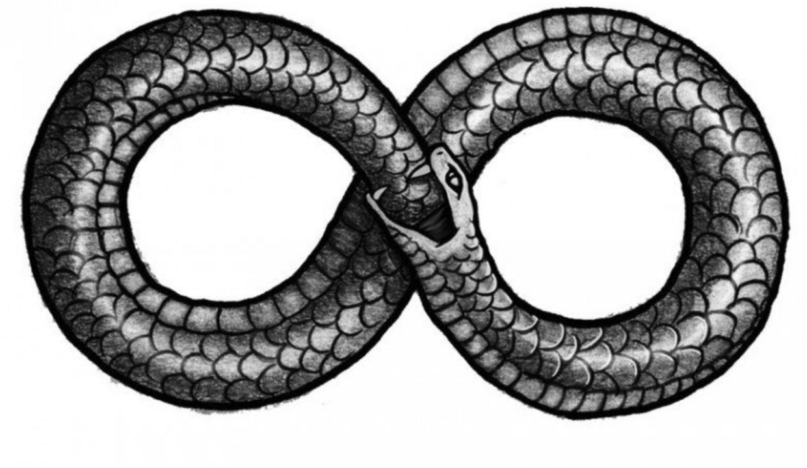

### 

Днес се случи нещо доста странно... И под „странно‘‘ имам предвид, че вече имам доста ясно доказателство (поне за себе си), че съзнанието ни пътува през различни времеви прозорци и може да избира времева реалност. И преди съм имала множество такива преживявания, но поне не помня те да са били толкова ясни и с такава точна синхроничност, разпростиращи се даже извън обсега на моето съзнание. 

Сега ще обясня.

След като се събудих в доста сносно настроение, още от сутринта имах особено предчувствие. Бях си наумила да си купя една голяма сфера от скъпоценен камък (вишнев кварц) и картите ми за деня бяха **Двойка пентакли** и **Силата**, така че, _I was likе: let’s go_! Постепенно денят ми започна да се зарежда с все по-високи вибрации. Впоследствие имах доста приятен разговор с продавачкат от магазина където закупих сферата. Разговорът, обаче ще запазя в тайна, тъй като беше доста личен (разговаряхме за новия път в живота ми), но още оттогава започнаха да ме засипват синхроничностите, които се напасваха изключително точно като парчета пъзел. Реших да предприема една метафизично-медитативна разходка из старата част на града (Велико Търново) и при такава, винаги следвам накъдето ме поведе Висшият ми Аз, без да намесвам Ума си и неговите „трябва“ команди, като внимателно следя мислите и усещанията си при преминаването на пространствените прозорци... Докато обикалях и долавях енергията и опитностите на паралелните си Азови инкарнации в една съседна времева реалия, които обитават къщите и улиците на подобен град (наистина нз как да го обясня, но long story short, Вал Валериан е прав...), попадах във все по-дълбок слой на съзнанието си. Което означаваше, че Матрицата щеше да се опита да ме събуди. И ето, че една черна котка се опита да ми мине път и аз пък реших, че няма да я оставя да го направи, защото знаех много добре, че това ще е **рестарт**, а тъкмо се бях усетила как минавам в по-високи вибрации и започвам да отварям портали към желаната от мен времева линия, която е извън матрицата на Тъмните.

Long story short,  Тъмните, които в момент управляват Земята и се опитват да има имат контрол върху всичките й потенциални и реални времеви линии, искат всеки път ние да „избираме“ да влизаме в най-кофтия и травмиращ вариант от предоставените ни опции, спрямо дизайна и програмата ни, с цел да ни манипулират към все по-дълбоко травмиране което пък ще доведе до все по-дълбоко закотвяне и зацикляне в матрицата и все по-малко степени на свободна воля и всичко това, за да може да източват биофотоните ни или нашата жизнена енергията. Всичко това се превръща при доста хора в един все по-дълбок loop. процес, който много трудно може да бъде спрян.
Малко за loop-a.
Повторяемостта на историята е всичко, от което има нужда един loop. Всеки път програмата на Тъмните ще се опитва да ни натика в цикъл на травматично повторение на ментални модели, които да ни водят все по-надолу по спиралата на Ума в генерирата от нас по този начин предвидима реалност, която става все по-негативна, и в която Любовта (като енергия и проявление) все повече изчезва и изчезва, а страхът като основна емоция и перцепция на реалността властва. А тя (Любовта) изчезва, тъй като биофотонният потенциал на ДНК-то ни е пряко свързан с възможността за  упражняване на **свобода и любов** или за **избор на различните потенциални състояние a.k.a. колапсиране на вълновата функция**. Не случайно, Астралното тяло е известно и като Емоционално тяло, което е един аспект ( н*ай-близкият*) до тази изначална Любов (_и всички знаем, че зад тази дума се крие нещо много повече_). 

Позитивната реалност на Източника е Любов- Светлина - Воля, а Тъмната: Апатия - Тъмнина - Страх. 

Тъмните държат това колапсиране да става винаги на върха на вълната, когато тялото е най-захранено с биофотонен потенциал, за да може да бъде източена максимално много енергия. След това индивидът станал жертва на това източване бива натикан в желаната реалност посредством повторението/рециклирането на стара травма, която се разиграва от програмата по нов начин, и която има за какво да се захване (_нещо, което ще обясня подробно как става друг път_).  Или на това му се казва в поп-езотериката "да не си си научил урока" Във всеки случай, по пътя към това постепенно достигане на пика на биофотонната вълна, има различни преминавания, в които програмата ще се опита да Ви „улови“ или да Ви следи. Това е част от механизма на Вселената да Ви предупреждава за предстояща опасност или за пътя по който сте тръгнали, нещо което Тъмните не могат да не включат в кода на своята Матрица, просто защото така работят нещата.

Спомняте ли си, когато във филма Матрицата се появи черна котка?

Meow, meow…

Във филма това означаваше, че някой променя нещо в матрицата и бърника из кода и това беше свързано с феномена дежа-вю. Точно, дежа вю, Вие дори не помните, но програмата Ви е рестартирала и Ви дава възможност да тръгнете по нов път и да направите нови избори. Или някой нарочно Ви е рестартирал в нова интерактивна линия на програмата. Това е част от механизма на предпазване, който обаче може да бъде хакнат от опитни "админи", ако Вие им позовлите. 

However, нещата са малко по сложни при феномена дежа-вю и той определено заслужава отделна статия. Във всеки случаи помнете, че този „админ“, който се разпорежда към момента със съответния регистър на по-голяната програма, коята прихваща Вашата, може да не е никак добронамерен. Колкото и високо да се намирате като вибрация и да сте свързан с Висшия си Аз, винаги има някой над Вас който Ви е хванал спатиите (ред. 31.07.2022 – _една година по-късно съм убедена, че промяната е лоша, демек, опитват се да те изкарат от лнията на свободна воля и да рестартират програмата от последното ниво, на което си бил/а, преди да повишиш биофотонния си потенциал. However, оставам оптимист, че eventually, е възможна някаква ментална Алхимия посредством която да имаме собствен админ контрол над Нашата реалност, без някой извънземен играч или архонт с по-високи админ права да Ни прихваща и манипулира..._ ).

Така погледнато, има логика в популярната поличба, че черна котка да ти мине път не е на късмет (някой обръща колелото на живота не в наша полза). Точно чрез това "предание" колективното подсъзнание се опитва да ни предупреди, че нещо се гъбарка с нас. 
И все пак, не забравяйте че изначално дежа-вю е механизъм на оригиналната програма на Вселената да ни предпази от собствените ни избори и да ни даде нов шанс да направим нови избори и да минем по нов път. Това е просто **glitch в матрицата, който показва „отворен шлюз“ за промяна на кода**, а вече кой играч и с каква цел ще се докопа до него е друг въпрос. Факт е, че към момента доста малко хора имат дори полусъзнателен контрол над процеса. Определено си е висш пилотаж да влезеш в ролята на администратор и да изместиш архонта или каквото там се опитва да те препрограмира обратно в loop-a_).

Така, към момента на появата на черна котка, това е само индикатор, че сте отворили такъв шлюз (а.к.а. **портал**). 
Портал към какво? Към повече степени на свобода и възможност за изманифестирате сценария, който Вие желаете, но който го няма по програма или пък сценарий, който ще Ви измъкне от даден тоскичен loop, или пък направо да навлезете в състояние, в което да нямате нужда от сценариий!!!:))) Срещнете ли черна котка, това е знак че сте в много висока степен на свободна воля и имате значителен контрол над програмата, затова сега архонтите се опитват да Ви прехванат. Вашата "нишка" на съзнанието се движи непредвидимо в пространство-времето и те имат нужда да Ви локализират, за да ви ограничат и наложат нов loop - демек, да се въртите на едно и също място, като хамстер в колело.
Или нещо друго:

Познатият ни Уроборос с Архонта-Змия. Истиснкият му смисъл е архонтът, който Ви е хванал н травматичен loop.

Инстинктивната ми реакция, когато видя черна котка, винаги е била да избягам от котката и да не й позволя да ми мине пътя. Много е забавно, наистина, как тези гадинки изскачат в най-тънкия момент от медитативното или транс състояние, точно когато преминавам през „коридор“ и си навлязъл в ново пространство на осъзнаване:) Никога няма да престана да се изумявам на бързината и точността на мехнизма:) Така че предприех нужното действие – да продължа по желания от мен път нагоре, но рязко да сменя траекторията си (_което btw  е много яко упражнение, при медитативна разходка, защото по този начин се излиза от предвидимостта, това че част от механизма на [raudonautica](https://www.randonautica.com/)_). 
Това очаквано се оказа доста добро решение.

ред. 31.07.2022, - АБСОЛЮТНО ВИНАГО ГО ПРАВЕТЕ! НЕ СЕ ШЕГУВАМ! ИЗБЕГНЕТЕ ТРАЕКТОРИЯТА НА ТОВА СЪЩЕСТВО ПО АБСЮЛЮТНО ВСЯКАКЪВ ВЪЗМОЖЕН НАЧИН, F CAPS LOCK, FOR CHRIST SAKE! Въобще не ме инетересува колко шашаво ще изглеждате в лицето на някой напълно irrelevant минувач ( f*** them NPC’s).

След като се измъкнах ловко от предвидимата траектория и избягах от черната котка и навлязох отново в **randomness**, потънах в още по-дълбок **фокус**, и съответно в още по-високо ниво на съзнание. Тогава се случи нещо интересно, което ще е свързано и с развръзката на тази статия. Реших да тръгна по една малка уличка, тъй като видях интересен гроб-паметник на въстаници, който привлече вниманието ми и на пътя ми моментално изскочи свръх-ентусиазирана котка☺ Не черна:D Уличните котки, които са отворени за контакт с Вас, винаги са много добър знак. Това означава **високи вибрации и навлизане в Астрала! Съзнание от по-висок порядък с възможност за контрол над времеви прозорци и портали, посредством астралното поле**. Боговете Ви се усмихват и Ви се радват:)

_Котките притежават гени от Сириус расите, поради което имат рептилска зеница и необичайни астрални способности, а и не само ;)_

Реших да погаля мацата и да я снимам, тъй като тя буквално ми се хвърляше:D Сякаш искаше да ми каже нещо и да ме защити, така го усещах... Докато си се радвахме взаимно, друга котка ни гледаше доста страхливо и срамежливо, сякаш искаше да каже нещо... тези създания са доста интелигентни, по простата причина че телата им са съд, в който могат посредством астралът да се въплъщават други същности. Още по-интересното е, че тези същности винаги са благоприятно настроене и е рядкост нещо негативно дасе прояви през тях, причината за товае  генетичната програма заложена от Сириус фракции. Да, има и такива, които ни мислят доборото:0 
In any case, **усещах как моментите се сменят като кадри и как всеки кадър носи енергийна вибрация и информация, и иска да ми каже нещо; като своеобразна картина – пъзел, която съзнанието ми нарежда момент по момент.**

**Прозорецът на изборите беше отворен.**

И тъкмо изпитвах абсолютен мир и спокойствие, усещах, че съм пренаредила миналото си и съм изкопчила максимума от него, че травмите са разрешени и забравени, а менталните програми – препрограмирани или форматирани и вече виждах новия път, по който поемам и по който всичките ми мечти могат да станат реалност, програмата е разбита, повторяемостта-LOOP-ът премахнат, всичко се нарежда... АЛЕЛУЯ!

.....и идва ето тази гадина отново.. имах особено предчувствие...

Докато се усетя вече ми беше преминала пътя доста демонстративно и интересното е, че на мястото на което се намирах беше така забутано (който е бил във Велико Търновските улички знае..), че ща не ща нямах друг път за ''бягство''.

До този момент снимах целия епизод с телефона си (забравих да кажа, че го бях извадила, за да снимам цялото очарователно преживяване още в мига, в който сладката котка започна да ми се хвърля); точно обаче когато черната котка успя буквално за няма и секунда да ми пресече пътя (премина като светкавица, от нищото!), по някаква странна причина камерата ми е престанала да снима...like.. в смисъл, този момент липсва, а аз го видях и го снимах, HUH??? Освен това, кълна се, всичко стана толкова бързо, че определено усещах нечия много бърза програмистка реакция...В този момент четях не само моето Съзнание, а нещо много по-голямо и сякаш можех да виждам и през тези други „очи“ на админа, който променя програната ми. 

Черната котка успя да мине тези почти 10 метра за един миг и това всъщност е стряскащо – бях тотално загубила фокус за някакъв период от време. (ето какво имам предвид, че времето тече през кадри и елементи на Съзнанието ни и не е фискирана константа извън нас и че в зависимост от честотата и броя на кадрите и нашето възприятие, всъщност ние определяме как тече то).
Буквално шок и разочарование. Усетих как нещо ми се изплъзва...и съм пак в състояние на рестарт на loop-a. Ключовият момент в историята тук е, че наскоро бях преживяла изключително болезнена раздяла, която имаше изключително голям травма потенциал, който обаче аз бях успяла да преодолея и да възстановя сърдечната си чакра и оттам вече, да визуализирам новата времева реалия за мен. Виждах, че мога да продължа напред пътя си и да изманифестирам това, което наистина искам този път, но.....

В следващия момент се сетих да погледна камерата на телефона си отново и имаше някакво превключване на кадри и камерата вече не работеше, беше се изключила сама. (свързано и с феномена, да не може да се заснеме НЛО с камера – те просто сменят кадъра, защото се движат извън линейното време-пространство, щрак и те са в един кадър, а ти в друг, става за милисекунди). На кратко, за да стане ясно, заснела съм цялото преживяване, включително и как черната котка преминава и това го помня МНОГО ЯСНО, но не само че това го няма на клипчето после, но и в моята реалност е „напъхан“ кадър, в който камерата ми се изключва от самосебе си, макар че аз въобще нямам спомени нито за това, нито за предното. Разбирате ли важността на спомените ни? Те сменят кадрите на това, което виждаме/преживяваме, но не и спомените ни! Очите лъжат. 
 Я се замислете, сега, какво наистина означава това за естеството на „реалността“ в която живеем и чия е тя, включително и Съзнанието/мозъкът/умът, които ние смятаме за „наши“?

Сигурно всичко това звучи леко объркано, но for Christ sake,  такива моменти и състояния на съзнанието много трудно се описват. Хората, които са ги преживявали, ще ме разберат...

И така, отново, сякаш се озовах в капан и този път програмата ме хвана... Просто ги усещаш тези неща..... Думите трудно могат да опишат дълбочината на усещането. След това реших, че е време да продължа по пътя си, като се върна назад (в посоката, в която черната котка тръгна). Но няма да се предам. И ще разбера кода на програмата и ще контролирам времевите ми линии в желаната от мен посока, към моята най-висша реалност, в която аз получавам всичко, което искам. 

✨
END OF STORY.

For Now…

P.S. По-късно имах синхронизация с ето това видео ❤️ :

https://youtu.be/Z-bohBW8BmQ
