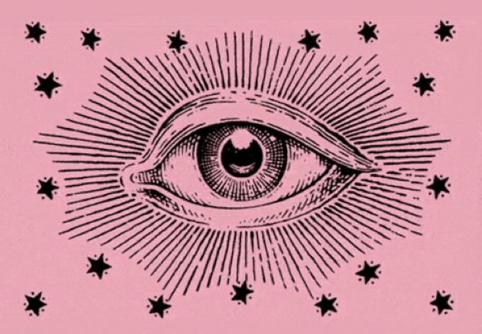
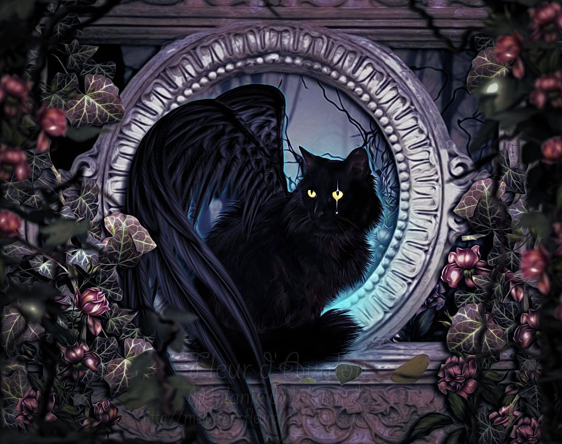
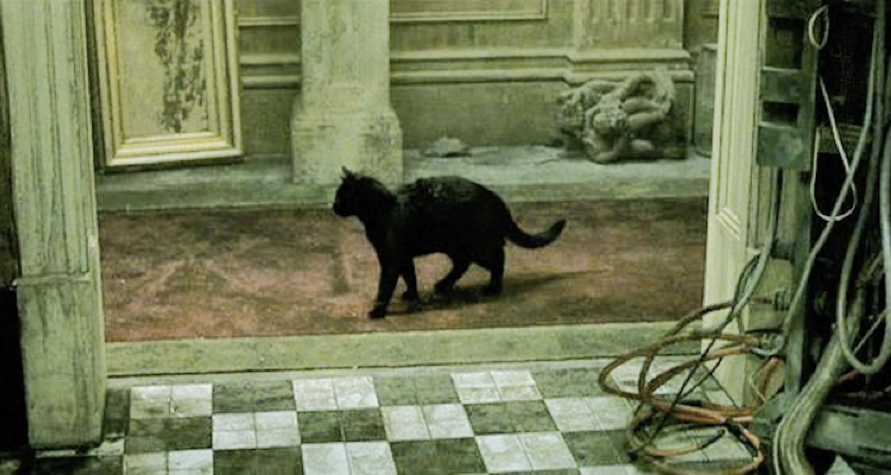
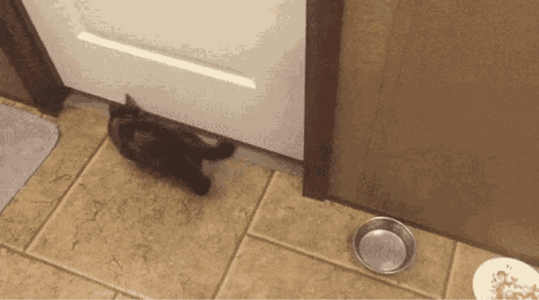

### (добър знак ли е черна котка да Ви мине пътя?)

Днес се случи нещо доста странно... И под „странно‘‘ имам предвид, че вече имам доста ясно доказателство (поне за себе си), че съзнанието ни пътува през различни времеви прозорци и може да избира времева реалност. И преди съм имала множество такива преживявания, но поне не помня, да са били толкова ясни и с такава точна синхроничност, разпростиращи се даже извън обсега на моето съзнание. Сега ще обясня.

След като се събудих в доста сносно настроение, още от сутринта имах особено предчувствие. Бях си наумила да си купя една голяма сфера от скъпоценен камък (вишнев кварц) и картите ми за деня бяха **Двойка пентакли** и **Силата**, така че, _I was likе: let’s go_! Постепенно денят ми започна да се зарежда с все по-високи вибрации. Впоследствие имах доста приятен разговор с продавачката, от където купих сферата, който обаче ще запазя в тайна, тъй като беше доста личен (макар че пак е супер свързан с нещата, ще кажа само, че говорихме за новия път в живота ми), но още оттогава започнаха да ме занимават синхроничностите, които се напасваха изключително точно като парчета пъзел. Реших да предприема една метафизично-медитативна разходка из старата част на града (Велико Търново) и при такава, винаги следвам накъдето ме поведе Висшият ми Аз, без да намесвам Ума си и неговите „трябва“, като следя мислите и усещанията си при преминаването на пространствените прозорци... Докато обикалях и размишлявах върху паралелните си Аз-инкарнации, които най-вероятно обитават къщите и улиците, по които минавах (:Д), само че в една съседна времева реалия, една черна котка  се опита да ми мине път и аз пък реших, че няма да я оставя да го направи, защото знаех много добре, че това ще е **рестарт**, а  тъкмо се бях усетила как минавам в по-високи вибрации и започвам да отварям портали към желаната от мен времева линия, извън матрицата на Тъмните.

Long story short,  Тъмните, които в момент управляват Земята и се опитват да има имат контрол върху всичките й потенциални времеви линии, искат всеки път ние да „избираме“ да влизаме в най-кофтия и травмиращ вариант от предоставените опции, спрямо дизайна и програмата ни, с цел, да ни манипулират към все по-дълбоко травмиране което пък ще доведе до все по-дълбоко закотвяне и зацикляне в матрицата и все по-малко степени на свободна воля и всичко това, за да може да източват биофотоните ни.. един все по-дълбок loop. Повторяемостта на историята е всичко, от което има нужда един loop. Демек, всеки път се опитват да ни натикат в цикъл на травматично повторение на ментални модели, които да ни водят все по-надолу по спиралата на Ума в генерирата от нас по този начин предвидима реалност, която става все по-негативна, и в която Любовта (като енергия и проявление) все повече изчезва и изчезва, а страхът като основна емоция и перцепция на реалността властва. А тя (Любовта) изчезва, тъй като биофотонният потенциал на ДНК-то ни е пряко свързан с възможността за  упражняване на **свобода и любов** или за **избор на различните потенциални състояние a.k.a. колапсиране на вълновата функция**. Не случайно, Астралното тяло е известно и като Емоционално тяло, което е един аспект ( н*ай-близкият*) до тази изначална Любов (_и всички знаем, че зад тази дума се крие нещо много повече_). Тъмните държат това колапсиране да става винаги на върха на вълната, когато тялото е най-захранено с биофотонен потенциал, за да може да бъдем източени. След това, индивидът, станал жертва на това източване, бива натикан, посредством повторението/рециклирането на стара травма, която се разиграва от програмата по нов начин, и която има за какво да се захване (_нещо, което ще обясня подробно как става друг път_). Във всеки случай, по пътя към това постепенно достигане на пика на биофотонната вълна, има различни преминавания,в които програмата ще се опита да Ви „улови“.

Спомняте ли си, когато във филма Матрицата се появи черна котка?

Meow, meow…

Във филма това означаваше, че някой променя нещо в матрицата, бърника кода и това беше свързано с феномена дежа-вю (добрем, _ето една нишка, по която ще тръгна в друга статия, като му дойде времето_).

Окей, моето лично усещане е, че това е точно така. However, не съм напълно сигурна за какъв тип промяна става въпрос – лоша или добра, в смисъл това зависи кой „админ“ се разпорежда в момента със съответния регистър, bet my ass, колкото и високо да сте, винаги има някой над Вас който Ви е хванал спатиите (ред. 31.07.2022 – _една година по-късно съм убедена, че промяната е лоша, демек, опитват се да те изкарат от лнията на свободна воля и да рестартират програмата от последното ниво, на което си бил/а, преди да повишиш биофотонния си потенциал. However, оставам оптимист, че eventually, е възможна някаква ментална Алхимия посредством която да имаме собствен админ контрол над Нашата реалност, без някой извънзмен играч или архонт с по-високи админ права да Ни прихваща..._ ).

Обаче, да Ви кажа честно, вярвам в мъдростта на старите хора и  всички знаем поличбата, че това не е на късмет (някой обръща колелото на живота не в наша полза). И все пак, моето лично усещане е, че това е просто **glitch в матрицата, който показва „отворен шлюз“ за промяна на кода**, а вече кой играч и с каква цел ще се докопа до него е друг въпрос (мда, _демек, по новите ми впечатления, си е висш пилотаж да влезеш в ролята на администратор към този момент и да изместиш архонта, който се опитва да те препрограмира обратно в loop-a_). Факт че, че архонтите хващат тази промяна в кода по-късно ( ред. 31.07.2022. – _мне, по-скоро има моменти, в които успяваш да станеш невидим за тях, докато отново ти хванат спатиите_). Тоест, към момента на появата на черна котка, това е само индикатор, че сте отворили такъв шлюз (а.к.а. **портал**). Портал към какво? Към повече степени на свобода и възможност за изманифестирате сценарият, който Вие желаете, но който го няма да програма или пък сценарий, който ще Ви измъкне от даден тоскичен loop или пък направо да навлезете в съсотяние, в което да нямате нужда от сценриий!!!:)))

Anyway, инстинктивната ми реакция винаги е била да избягам от котката и да не й позволя да ми мине пътя, а аз ВЯРВАМ на инстинктите си! (_много е забавно, наистина, как тези гадинки изскачат в най-тънкия момент от медитативното или транс състояние, точно когато си преминал „коридор“ и си навлязъл в ново пространство на осъзнаване_), така че предприех нужното действие (_дуалната матрица, бейби - всяко лошо нещо носи положителен шанс и всяко добро нещо отваря пътя за негативност_;)  да продължа нагоре, но рязко да сменя траекторията си (_което btw  е много яко упражнение, при медитативна разходка, защото по този начин се излиза от предвидимостта, за справка на принципа – метода [raudonautica](https://www.randonautica.com/)_).  Това се оказа доста добро решение (естествено).

ред. 31.07.2022, - АБСОЛЮТНО ВИНАГО ГО ПРАВЕТЕ! НЕ СЕ ШЕГУВАМ! ИЗБЕГНЕТЕ ТРАЕКТОРИЯТА НА ТОВА СЪЩЕСТВО ПО АБСЮЛЮТНО ВСЯКАКЪВ ВЪЗМОЖЕН НАЧИН, F CAPS LOCK, FOR CHRIST SAKE! Въобще не ме инетересува колко шашаво ще изглеждате в лицето на някой напълно irrelevant минувач ( f*** them NPC’s).

След като се измъкнах ловко от предвидимата траектория, избягах от черната котка и влязох отново в **randomness**, навлязох в още по-дълбок **фокус**, и съответно започна пребиваването ми в по-високо ниво на съзнание. Тогава се случи нещо интересно, което ще е свързано и с развръзката на тази статия. Срещнах котка.:D Да, no joke. Уличните котки, които са отворени за контакт с Вас, винаги са много добър знак. Това означава **високи вибрации и навлизане в Астрала! Съзнание от по-висок порядък с възможност за контрол над времеви прозорци и портали, посредством астралното поле**.

_Котките притежават гени от Сириус расите, заради което имат рептилска зеница и необичайни астрални способнсти, а и не само ;)_

Реших да тръгна по една малка уличка, тъй като видях интересен гроб-паметник на въстаници, който привлече вниманието ми и на пътя ми моментално изскочи свръх-ентусиазирана котка☺

Реших да погаля мацата и да я снимам, тъй като тя буквално ми се хвърляше :D Сякаш искаше да ми каже нещо и да ме защити....Докато си се радвахме взаимно (:D), друга котка ни гледаше доста страхливо и срамежливо, сякаш искаше да каже нещо ...In any case, **усещах как моментите се сменят като кадри и как всеки кадър носи енергийна вибрация и информация, и иска да ми каже нещо, като своеобразна картина – пъзел, която съзнанието ми нарежда момент по момент.**

**Прозорецът на изборите беше отворен.**

И тъкмо изпитвах абсолютен мир и спокойствие, усещах, че съм пренаредила миналото си и съм изкопчила максимума от него, че травмите са разрешени и забравени, а менталните програми – препрограмирани или форматирани и вече виждах новия път, по който поемам и по който всичките ми мечти могат да станат реалност, програмата е разбита, повторяемостта-LOOP премахната, всичко се нарежда... АЛЕЛУЯ!

.....и идва ето тази гадина отново.. имах особено предчувствие...

Докато се усетя вече ми беше преминала пътя доста демонстративно и интересното е, че на мястото на което се намирах беше така забутано (който е бил във Велико Търновските улички знае..), че ща не ща нямаш друг път за бягство...

До този момент снимах целия епозод с камерата си (забравих да кажа, че бях извадила телефона си да снимам цялото очарователно преживяване още в мига, в който сладката котка започна да  ми се хвърля);  точно обаче когато черната котка успя буквално за няма и секунда да ми пресече пътя (премина като светкавица, изскочила от нищото), по някаква странна причина камерата ми е престанала да снима...like.. в смисъл, този момент липсва, а аз го видях и го снимах, HUH??? Освен това, кълна се, всичко стана толкова бързо, че определено усещах нечия много бърза програмистска реакция...В този момент четях не само моето Съзнание, а нещо много по-голямо и сякаш можех да виждам и през други „очи“. 

Черната котка успя да мине към  почти 10 метра за един миг и това всъщност е стряскащото – бях тотално загубила фокус за някакъв период от време. (ето какво имам предвид, че времето тече през кадри и елементи на Съзнанието ни и не е фискирана константа извън нас и че в зависимост от честотата и броя на кадрите и нашето възприятие, всъщност ние определяме как тече то). And I was like…wtf??? Буквално шок и разочарование. Усетих как нещо ми се изпълзва...и съм пак в състояние на рестарт.

В следващия момент се сетих, че съм включила камерата и като погледнах, сякаш имаше някакво превключване на кадри вече, камерата вече не работеше (което според мен е физическо явление свързано с феномена, да не можем да снимаме НЛО с камера – просто сменят кадъра, защото се движат и манипулират кораба извън линейното време, щрак и те са в един кадър, а ти в друг, за милисекунди;). На кратко, за да стане ясно, снимала съм цялото преживяване, включително и как черната котка преминава и това го помня много ясно, но не само че го няма на клипчето после, но и после в моята реалност се „пъха“ кадър, който показва, че съм спряла да снимам преди това. М, това демонстрация на това как работят нещата ли е ? Я се замислете, сега, какво наистина означава това за естеството на „реалността“ в която живеем и чия е тя, включително и Съзнанието, което ние смятаме за „наше“?

Сигурно всичко това звучи леко объркано, но for Christ sake,  такива моменти и състояния на съзнанията много трудно се описват. Хората, които са ги преживявали, ще ме разберат...

И така, отново, сякаш се озовах в капан и този път програмата ме хвана; както и да е.... Просто ги усещаш тези неща..... Думите трудно могат да опишат дълбочината на усещането. След това реших, че е време да продължа по пътя си, като се върна назад (в посоката,  в която черната котка тръгна). Но няма да се предам. И ще разбия кода на програмата и ще контролирам кадрите.

✨
END OF STORY.

For Now…

P.S. По-късно имах синхронизация с ето това видео, слочаеносс, не мисла... ❤️ :

https://youtu.be/Z-bohBW8BmQ
